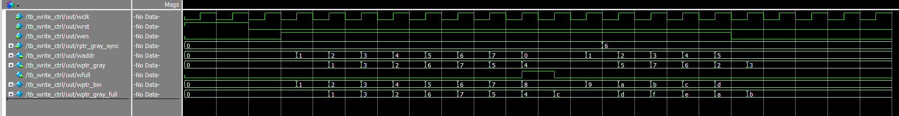
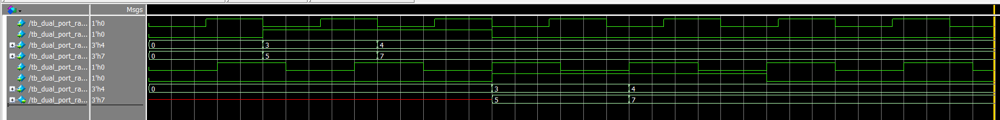

# README
这里记录着我写verilog代码时的疑问和学习。

## write_ctrl
### 写代码的逻辑是什么？  
1. 首先要写信号：
  * 📥 Inputs（来自哪里？）
    * 写时钟信号【提示：FIFO 是异步的，写和读时钟分开，写控制模块用哪个时钟？】
    * 写使能信号（是否写入）【提示：这个信号由外部模块控制，用来决定是否尝试写数据。】
    * FIFO已满标志？【提示：如果FIFO满了，还能写吗？这个信息从哪里来？你需要接收它还是计算它？】
    * 读指针（同步过来的）【提示：你是否需要判断“满”？那你要和谁比较？异步域的信号可以直接比较吗？】  
  * 📤 Outputs（你要输出给谁？）
    * 写地址（写指针）【提示：你要输出写地址给 RAM，同时也可能输出一个格雷码版本用于跨时钟同步。】
    * 写指针（格雷码）【提示：异步FIFO通常会输出一个“同步友好”的写指针给读域。】
    * 满信号（FIFO full）【提示：你是否要计算 FIFO 是否满？满的时候外部就不该写了。】

2. 接着是逻辑
异步FIFO的逻辑是这样的：
```
                +--------------------+
   wen & ~wfull |                    |
     ---------->+ ① wptr_bin         |
                | (计数器递增逻辑)    |
                +--------------------+
                         |
                         v
              +---------------------+
              |② assign waddr       |
              |waddr = wptr_bin[2:0]|
              +---------------------+
                         |
                         v
              +-----------------------------+
              |③ assign wptr_gray           |
              |wptr_gray = wptr_bin ^ (>>1) |
              +-----------------------------+
```
* 写指针（二进制）逻辑
* 写地址输出
* 写指针的格雷码形式
### 为什么在write_ctrl.v中我使用的是wire，而不是reg？  
因为根据[FIFO基础](https://hauuhang.github.io/2025/04/05/FIFO_Basics/)中描述，我提到*full= {~wptr[3],wptr[2:0]}=={rptr[3:0]}*，这是一种组合逻辑，就要用wire
### 波形图

```
`timescale 1ns/1ps

module tb_write_ctrl;

    reg wclk;
    reg wrst;
    reg wen;
    reg [2:0] rptr_gray_sync;
    wire [2:0] waddr;
    wire [2:0] wptr_gray;
    wire wfull;

    // 实例化
    wirte_ctrl uut(
        .wclk(wclk),
        .wrst(wrst),
        .wen(wen),
        .rptr_gray_sync(rptr_gray_sync),
        .waddr(waddr),
        .wptr_gray(wptr_gray),
        .wfull(wfull)
    );

    // 生成时钟
    always #5 wclk = ~wclk;

    initial begin
        $dumpfile("wave.vcd"); // 生成波形文件 (iverilog)
        $dumpvars(0, tb_write_ctrl);

        // 初始化
        wclk = 0;
        wrst = 1;
        wen  = 0;
        rptr_gray_sync = 3'b000;

        // 复位一段时间
        #20;
        wrst = 0;

        // 写几次数据
        #10; wen = 1;
        repeat(10) #10;

        // 模拟FIFO满
        rptr_gray_sync = 3'b110; // 可以调整为和wptr_gray_full一致的值，观察wfull变化

        // 写使能继续，看是否被禁止写
        repeat(4) #10;

        // 结束
        wen = 0;
        #50;
        $finish;
    end
endmodule
```

## read_ctrl
### 这个模块的代码逻辑是什么？
和写代码的很像，就几乎把`w`变成`r`就行了，不多赘述

## dual_port_ram
### 我不太懂[7:0]和[2:0]究竟是什么，我想要一个8-deep的FIFO
在 Verilog 中，[a:b] 是位宽定义，表示这个信号有多少位（bit）
[7:0]	表示一共有 8 位（bit）	可以表示 0 到 255 的数（1 byte）
[2:0]	表示一共有 3 位（bit）	可以表示 0 到 7（8个地址）

### 为什么这个里面不用wrst和rrst
因为这个模块只是一个 纯存储器（memory）模块，RAM 本身是：同步写、同步读；没有“状态”需要复位；读写操作全靠 wen/ren + clk 控制；数据存在 RAM 的数组里（如 mem[0:7]），不受 reset 控制清空

### mem[waddr] <= wdata 的意思是wdata赋值给men的waddr中吗？
在硬件中你可以把 mem[...] 看成一个可以存很多小值的“储物柜”，waddr 就是柜子号，wdata 是你放进去的东西。

### 波形图
